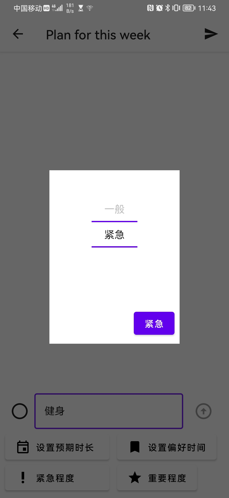
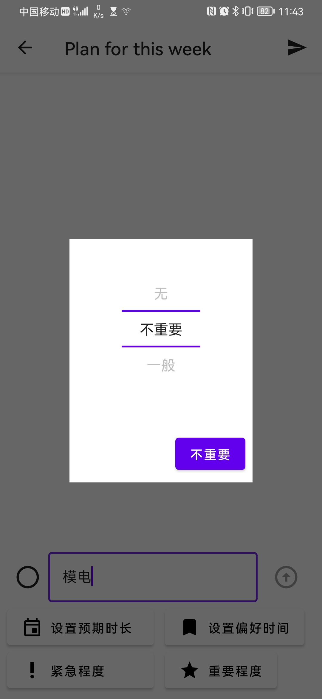
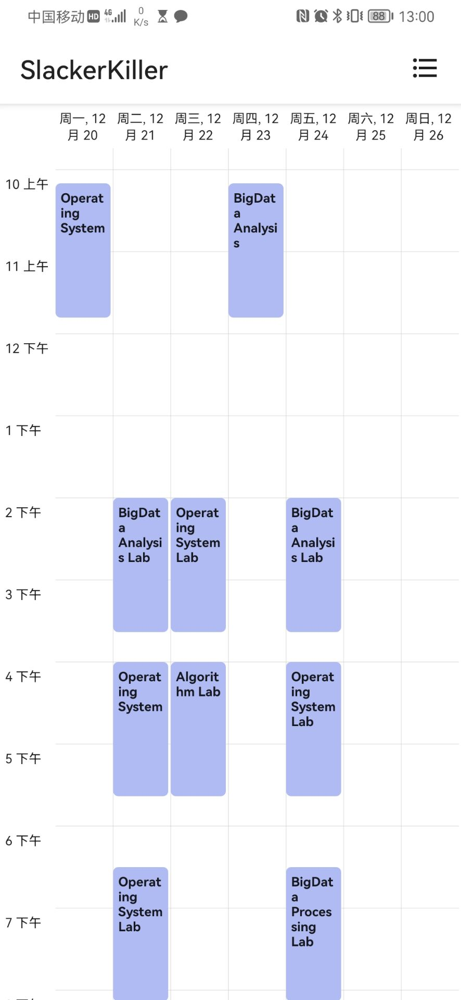
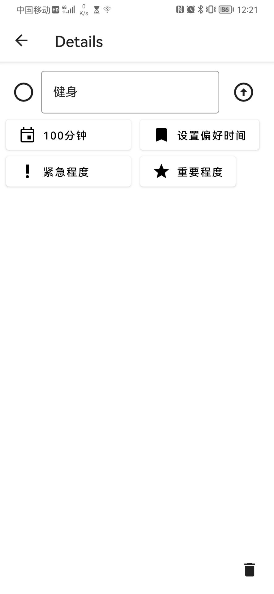
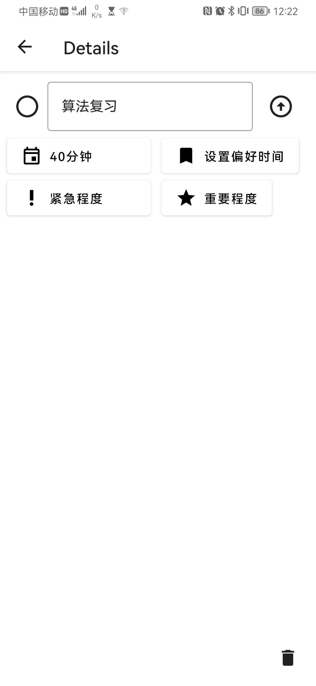
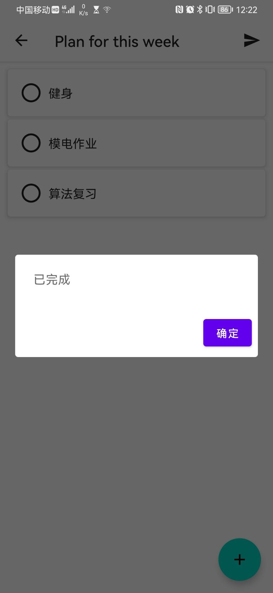
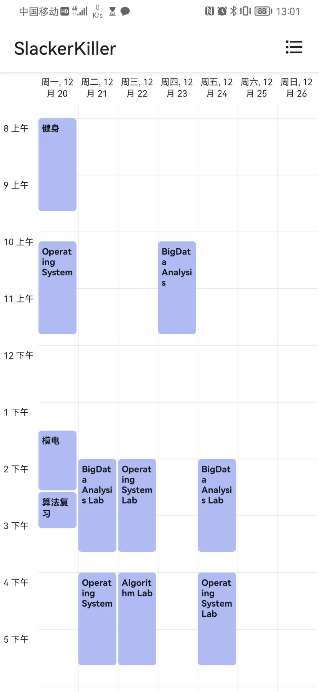

# SlackerKiller

## 界面导航

<a href="#why">产品初衷</a>

<a href="#what">产品功能</a>

<a href="#feature">使用介绍</a>

<a href="download">下载链接</a>

<a href="#tobecon">未来改进</a>

## <a id="why">做这款slackerKiller应用的初衷</a>

- 自己作为一名计算机大三的学生深感时间的不够用，以及因为课程导致的时间碎片化问题，加上轻微的拖延症导致很多时间临到ddl才开始做或者根本没时间做。我极度需要一个任务分配的工具来帮助用户将锁片化的时间充分利用起来。
- 这个应用需要满足我的需求:
  - 根据用户的课程计划(这是固定的，由课表或者教务后台读取)和添加的学习生活任务，为用户制定合理的任务分配表
  - 可以在适当时候提醒用户开始任务
  - 对工作学习任务的工作情况做总结

- 本质上这是一款智能的任务分配及提醒的应用

## <a id="what">具体我们的应用能为你实现什么</a>

你可以为你完成的任务进行==紧急程度的设置==，如果你希望某一个任务今早完成，那么请为任务设置高紧急度!

你还可以为你的一天生活选择一个==偏好时间==，比如，小卢同学喜欢早起，那么他就想在早上完成一些重要的任务，那么"懒蛋杀手“就提供了这么一个偏好时间段的选择

> 至于什么任务对于你来说是重要的，对于一个小同学Free来说，他觉得健身是重要的
>
> 
>
> 而对他来说模电的就是非常不重要的，那么他指定了两个任务:健身(重要)，模电作业(不重要)，如上面所说的假设他也选择了早上作为自己的偏好时间。那么“懒蛋杀手”就会为Free同学优先在早上的空闲时间分配健身的任务，而可能在晚上为他分配模电任务。
>
> 如此他就可以在自己效率最高的时间段完成他认为重要的任务(健身)，而在他已经昏昏欲睡效率低下的时候就开心地(摆烂)完成他的模电作业咯！
>
> 
>
> 

(暂时因为一些bug没有上线)不要担心你的任务可能在自己预设的时间里无法完成，"懒蛋杀手"还有一个特别的功能就是==对你任务的回顾和总结==

如果你在某个任务完成时，“懒蛋杀手”会提供你一个打分机制，如果你觉得这个任务我完成的非常好，那么选择满星!但是如果一个任务完成的很烂，比如，Free同学在写模电作业的时候睡着了，等他睡醒发现，他的预设时间已经到了，不要担心! 他只需要选择低星级并让"懒蛋杀手"为你分配另外的时间继续完成就好

除此之外，"懒蛋杀手"在每周末的时候会为你做一个总结，你完成某一些任务的平均评价它都会展示给你，让你能在下次分配任务时间时做出更好的决断。

当然，你可能会问:"QAQ,那如果我想摆烂怎么办，懒蛋杀手把我的时间都分配出去了，好难受!"。

不用担心，你可以给自己==分配一个课程任务叫休息==啊,当然如果你按照正常操作进行分配，"懒蛋杀手"可能不知道把这个事件分到了哪里去了，所以你需要做一些额外的操作:为这个休息任务选择为课程标签，这样你就可以规定它精确的开始时间和结束时间了。

当然我强烈不建议你那么做，因为如果你做这样的操作，"懒蛋杀手"会把你吃掉的!

## <a id="feature">产品简介</a>

下面来认识我们的懒蛋终结者吧

- 初始化课表

- 添加任务

  | 健身:100分钟、重要、紧急                      | 模电:65分钟、不紧急、不重要                   | 算法复习:40分钟、一般紧急、一般重要           |
  | --------------------------------------------- | --------------------------------------------- | --------------------------------------------- |
  |  |  |  |

  

  - todolist展示

    

- 分配任务

  

  

- 分配结果

## <a id="download">下载来玩吧!</a>

<a href="slackerkiller-a0.0.2.apk">SlackerKiller</a>

## <a id="tobecon">to be continue</a>

- 导入教务系统
- 总结功能的完善
- 给自己设置课程
- 任务的地点聚类

